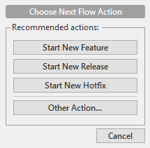
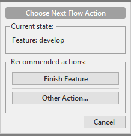

# git-flow_practise
git 특강에서 배운 브랜치 전략인 git-flow 연습하기

### sourcetree에서 git flow 설정하기

0) github에 repository를 만들고 이를 클론(clone)하기. 
1) 깃플로우(git flow)를 클릭한 뒤에 아무 것도 손대지 말고 기본 설정값 이용. 
2) develop 브랜치가 생성되고 기본 브랜치로 설정됨. 
3) 물론 이는 sourcetree에만 반영되기 때문에, push 하기. 
4) github에 들어가 해당 repository setting의 branch에 들어가 default branch를 develop으로 선택. 

### git-flow을 이용해 개발하기
#### 기능 구현하기

1) 깃플로우를 클릭하고 '새 기능 시작하기'를 클릭. 이때 현재 develop 브랜치 안에 있는지 확인하기. 
2) feature 이름은 이슈 번호와 간략한 설명으로 정하기. 
3) 기능을 구현했다면 'fixed #<이슈번호>'를 포함해 커밋 메시지를 작성하기. 
해당 이슈와 관련된 커밋이 무엇인지 확인하기 위함.. 기본 브랜치인 develop과 병합될 때 이슈가 자동으로 닫힘. 
4) 구현한 기능에 대한 코드가 있는 feature/-------- 브랜치를 선택하고 push. 
5) 기능 구현에 성공했다면 기능 브랜치를 develop으로 병합. 그 방법은 다음과 같음. 
5-1) git-flow의 finish feature를 이용해 병합하기. 
5-2) github에서 pull request 생성하기(github flow). 
   1 repository 상단의 pull requests를 클릭. 
   2 new pull request 클릭. 
   3 develop 브랜치에 feature/-----를 병합할 것이기 때문에 compare를 freature/------로 변경. 
   4 create pull request 클릭. 

   자동 병합이 가능한지 여부를 확인 가능하고 github에서 바로 병합할 수도 있음. 
   pull request 생성 이후에는 코드에 코멘트도 달아줄 있음. 
6) 병합을 수행하면 feature/------ 브랜치는 사라지는데 로컬 저장소에는 해당 브랜치가 남아있는 것으로 표시됨. fetch를 수행하고, <strong>develop 브랜치로 이동!!! 병합된 브랜치 삭제하기</strong> 

#### 릴리즈하기
1) 깃플로우에서 '새 릴리즈 시작하기'를 클릭. 
2) 이름은 ver.1.0 이런식으로 지어주기. 
3) 테스트 후 문제가 없다면 깃플로우에서 '릴리즈 마무리'를 클릭. 
4) 릴리즈가 완료되면 릴리즈 브랜치가 develop과 master에 병합되고 tag가 생성됨. 
5) develop, master, tag를 모두 push! 
6) github에 들어가 해당 repository의 release를 클릭하고 릴리즈 태그의 'Add release notes'를 클릭. 
7) 이름, 설명을 작성하고, 필요한 파일이 있다면 첨부하기. 

--------------------------------------------------------------------------------------------------------

## github 활용하기...

### 프로젝트를 같이 만들 사람 추가하기

1) 해당 repository의 settings를 클릭 
2) 왼쪽 메뉴에서 collaborators를 클릭 
3) github 아이디를 이용해 협력자를 검색해서 추가 

### 프로젝트에 참여하기

1) 초대받은? 프로젝트의 repository를 클론 
2) git-flow 설정하기 
   이때 develop과 master 브랜치가 모두 로컬에 있어야 가능.. 

### milestone(마일스톤) 설정하기
프로젝트 진행 상황을 확인하기 위해 사용하는 듯... 

1) repository 상단의 issues를 클릭 
2) milestones를 클릭 
3) new milestone 클릭 
4) 이름, 설명, 기한 저장하기 

### 라벨 설정하기

1) repository 상단의 issues를 클릭 
2) labels를 클릭 
3) new label을 클릭 
4) 라벨 이름과 색상을 지정할 수 있음 

### 이슈 생성하기
1) repository 상단의 issues를 클릭 
2) new issue를 클릭 
3) 제목, 라벨, 마일스톤, 내용을 작성하고 담당자를 정함 
   댓글을 통해 해당 이슈에 대해 이야기 나눌 수 있음

----------------------------------------------------------------------------------

### git flow를 연습하면서... 생긴 크고 작은 오류와 실수, 그 해결방안들

1) 새로운 기능을 만들기 위해 develop 브랜치 안에서 깃 플로우를 클릭하면 다음과 같이 창이 떠야한다. 

그런데 나는 이상하게 떴다... 

또 feature 디렉토리 안에 브랜치가 만들어지는 것이 아니라 master 브랜치와 develop 브랜치가 있는 곳에 새로운 브랜치(기능을 만들기 위한)가 만들어졌다. 

<해결방안!!>
저장소 -> 저장소 설정 -> 설정 파일 편집 클릭 
config 파일을 
[gitflow "prefix"] 
bugfix = bugfix/ 
feature = feature/ 
hotfix = hotfix/ 
release = release/ 
이렇게 고쳐주면 된다. 

